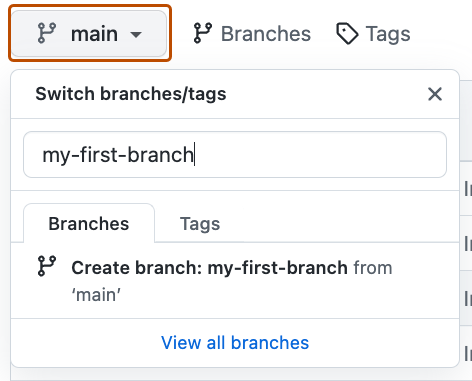
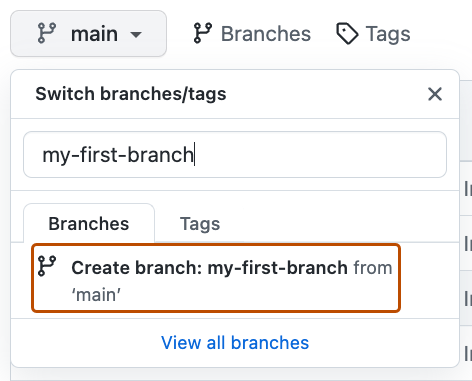

## Étape 1 : créer une branche

Bienvenue dans ta première manipulation GitHub.

Avant de modifier un projet partagé, on évite généralement de travailler directement sur la branche principale. On crée une **branche** dédiée à son travail.

### 📖 Qu'est-ce qu'une branche ?

Une branche est une version parallèle de l'historique du dépôt.

La branche principale de ce dépôt s'appelle `main`. Elle représente la version de référence du projet.

En créant une autre branche, tu peux modifier des fichiers, faire des commits et expérimenter sans modifier immédiatement `main`.

C'est une pratique fondamentale dans la plupart des projets logiciels.

### 👀 Où trouver le menu des branches ?

Dans l'onglet **Code**, GitHub affiche actuellement la branche `main`.



### ⌨️ Exercice : créer `my-first-branch`

1. Garde cette Issue ouverte dans cet onglet.
2. Ouvre la page principale du dépôt dans un **second onglet**.
3. Dans l'onglet **Code**, ouvre le menu des branches.
4. Crée exactement la branche :

```text
my-first-branch
```



> [!IMPORTANT]
> Le nom `my-first-branch` est vérifié automatiquement. Utilise exactement ce nom.

### 💻 Option terminal

```bash
git checkout -b my-first-branch
git push -u origin my-first-branch
```

<details>
<summary>Un problème ?</summary>

Vérifie que :

- la branche s'appelle exactement `my-first-branch` ;
- elle a été créée depuis `main` ;
- elle est bien publiée sur GitHub.

</details>

Une fois la branche créée, le cours détectera automatiquement l'action et affichera l'étape suivante.
