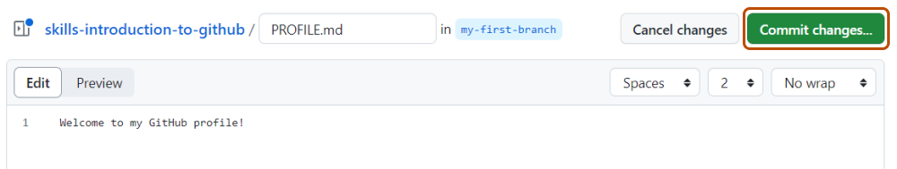

## Étape 2 : créer un fichier et ton premier commit

Ta branche existe maintenant. Tu peux y modifier le projet sans changer `main`.

### Qu'est-ce qu'un fichier Markdown ?

Tu vas créer `PROFILE.md`. L'extension `.md` indique un fichier **Markdown**, un format texte simple utilisé partout sur GitHub pour écrire des README, de la documentation et des commentaires structurés.

### Qu'est-ce qu'un commit ?

Un **commit** est un point enregistré dans l'historique Git.

Il contient notamment :

- les modifications enregistrées ;
- leur auteur ;
- leur date ;
- un **message de commit** qui résume ce qui a changé.

Un message clair rend l'historique compréhensible pour toi et pour les autres contributeurs.

### Activité : créer `PROFILE.md`

1. Dans l'onglet **Code**, vérifie que la branche affichée est bien `my-first-branch`.
2. Clique sur **Add file**, puis **Create new file**.

   

3. Dans **Name your file...**, saisis :

   ```text
   PROFILE.md
   ```

4. Dans le fichier, écris au minimum :

   ```markdown
   # Mon profil

   Hello GitHub !

   Je découvre les branches, les commits et la collaboration sur GitHub.
   ```

   

5. Clique sur **Commit changes...**.
6. Dans **Commit message**, écris exactement :

   ```text
   Ajouter PROFILE.md
   ```

   

7. Confirme avec **Commit changes**.

> [!IMPORTANT]
> Le cours vérifiera trois choses : que `PROFILE.md` existe, qu'il contient le mot `Hello`, et que le message du commit contient `Ajouter PROFILE.md`.

<details>
<summary>Option terminal</summary>

```bash
git switch my-first-branch
printf "# Mon profil\n\nHello GitHub !\n" > PROFILE.md
git add PROFILE.md
git commit -m "Ajouter PROFILE.md"
git push
```

Ici, `git add` prépare le fichier pour le prochain commit, `git commit` crée le commit, puis `git push` envoie ce nouveau commit vers GitHub.

</details>

Dès que GitHub reçoit ce commit sur `my-first-branch`, Mona vérifie ton travail puis affiche l'étape suivante.
