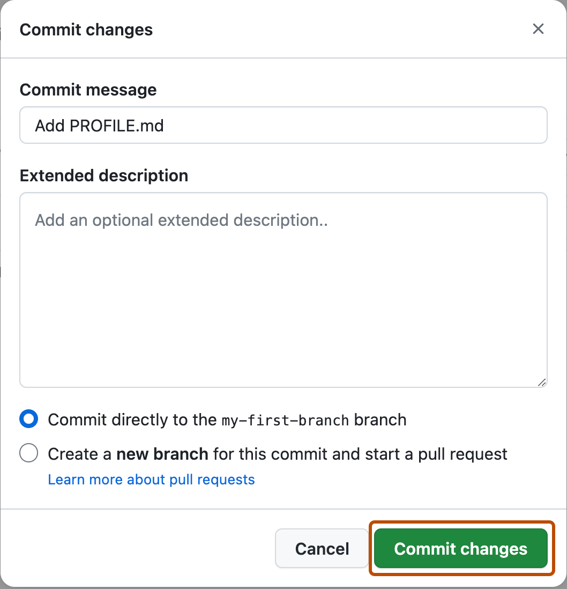

## Étape 2 : modifier un fichier et créer un commit

Ta branche est prête. Tu vas maintenant effectuer une modification et l'enregistrer dans l'historique du projet.

### 📖 Qu'est-ce qu'un commit ?

Un **commit** est un enregistrement d'un ensemble de modifications.

On peut le voir comme un point de sauvegarde identifié dans l'historique Git.

### ✍️ Exercice : modifier `playground/README.md`

Sur la branche **`my-first-branch`** :

1. Ouvre `playground/README.md`.
2. Clique sur l'icône d'édition.
3. Ajoute quelques lignes pour te présenter.
4. Fais apparaître le mot **`Hello`**.
5. Clique sur **Commit changes...**.




> [!IMPORTANT]
> Le cours vérifiera automatiquement que `playground/README.md` existe et contient le mot `Hello`.

### 💻 Option terminal

```bash
git checkout my-first-branch
printf "\nHello, je découvre GitHub !\n" >> playground/README.md
git add playground/README.md
git commit -m "docs: add my introduction"
git push
```

<details>
<summary>Un problème ?</summary>

Vérifie que tu modifies bien `my-first-branch` et non `main`.

</details>
