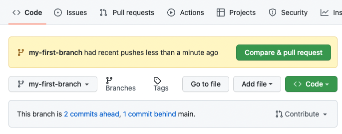
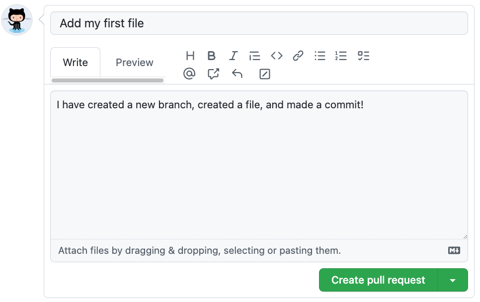

## Étape 3 : ouvrir une pull request

Tu as maintenant une branche contenant un changement qui n'existe pas encore dans `main`.

Il faut proposer son intégration au projet.

### 📖 Qu'est-ce qu'une pull request ?

Une **pull request**, souvent abrégée **PR**, est une proposition de changement.

Elle permet de faire relire son travail avant intégration.

### ⌨️ Exercice : créer ta première pull request

1. Après ton commit, clique sur **Compare & pull request**.

2. Vérifie les branches :

- **base** : `main`
- **compare** : `my-first-branch`

3. Ajoute une description expliquant ton changement.

4. Clique sur **Create pull request**.

> [!IMPORTANT]
> Une description non vide est demandée par l'exercice.

### 🔍 Explore ta PR

Regarde les onglets :

- Conversation ;
- Commits ;
- Checks ;
- Files changed.

Un problème ?

Vérifie que ta branche contient bien un commit différent de `main`.

Une fois la pull request créée, le cours vérifiera sa description.
