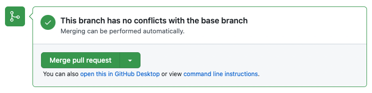
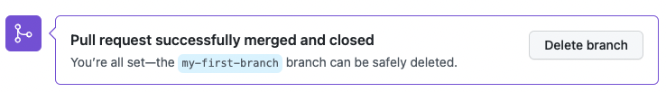

<!-- github-basics:step-4 -->

## Étape 4 : relire puis merger ta pull request

Ta pull request est valide. La suite se déroule directement ici, dans sa **Conversation**.

Avant de merger, prends quelques minutes pour comprendre les principaux onglets d'une PR.

### Les quatre vues utiles d'une pull request

- **Conversation** : le fil de discussion et l'historique des événements de la PR. C'est ici que Mona te parle.
- **Commits** : les commits contenus dans ta branche et proposés par cette PR.
- **Checks** : les vérifications automatiques exécutées par GitHub Actions ou d'autres outils.
- **Files changed** : le **diff**, c'est-à-dire l'affichage précis des lignes ajoutées, supprimées ou modifiées.

Une **review** est la relecture d'une pull request par une autre personne. Elle peut approuver le changement, poser une question ou demander une modification.

### Activité : relire ton changement

1. Ouvre **Files changed**.
2. Vérifie que `PROFILE.md` contient uniquement ce que tu voulais ajouter.
3. Ouvre **Checks** et vérifie que les automatisations ont terminé.
4. Reviens dans **Conversation**.

Cette relecture est importante : un merge intègre ce qui est affiché dans la PR, pas ce que tu pensais avoir modifié.

### Qu'est-ce qu'un merge ?

Un **merge** intègre les changements de ta branche dans la branche de destination, ici `main`.

Après le merge, `PROFILE.md` fera partie de la version principale du dépôt.

### Activité : merger la pull request

1. Clique sur **Merge pull request**.
2. Clique sur **Confirm merge**.
3. Une fois le merge terminé, clique sur **Delete branch** si GitHub te le propose.

   

> [!NOTE]
> Si le bouton de merge est temporairement désactivé, attends la fin des checks puis actualise la page.

Après le merge, reste encore dans cette conversation : Mona y publiera le bilan du cours.
