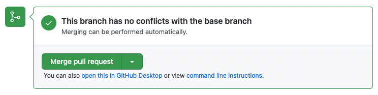
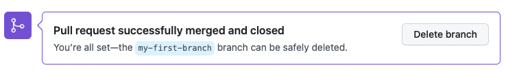

## Étape 4 : relire et merger la pull request

Ta pull request relie maintenant ton travail à la branche principale.

### 📖 Qu'est-ce qu'un merge ?

Un **merge** intègre dans une branche les changements provenant d'une autre branche.

Ici, le but est d'intégrer `my-first-branch` dans `main`.

### 🔍 Avant de merger

Dans ta pull request vérifie :

- les fichiers modifiés ;
- les checks ;
- la discussion.

### ⌨️ Exercice : merger la pull request

1. Clique sur **Merge pull request**.
2. Clique sur **Confirm merge**.
3. Tu peux ensuite supprimer la branche.





### ⚠️ Et s'il y a un conflit ?

Un conflit apparaît lorsque Git ne peut pas choisir automatiquement quelle version conserver.

Les marqueurs ressemblent à :

```text
<<<<<<< HEAD
ta version
=======
l'autre version
>>>>>>> main
```

<details>
<summary>Un problème ?</summary>

Si le bouton de merge est désactivé :

- attends la fin des checks ;
- vérifie les conflits éventuels ;
- vérifie que les étapes précédentes sont validées.

</details>

Merge maintenant ta pull request. Le cours affichera automatiquement le bilan final.
